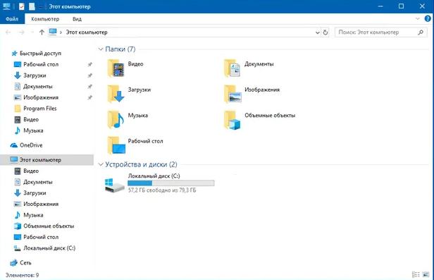
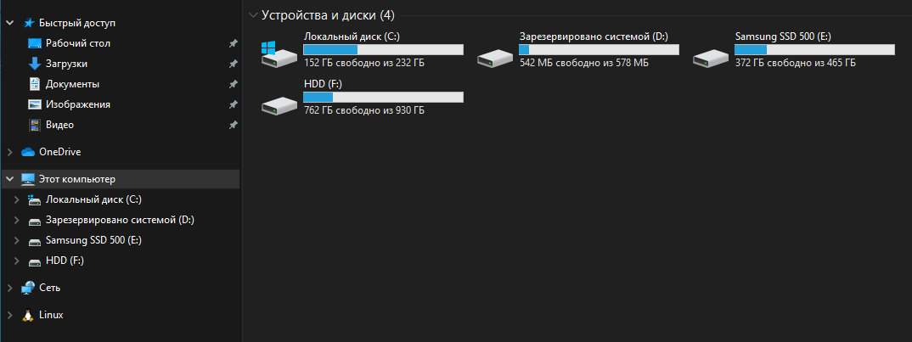

# Удаление избыточных ярлыков из проводника

В Win10 в исходном варианте в узле "Мой компьютер" отображаются элементы из группы "Папки" выше дисков.

Их можно убрать удалив элементы реестра по пути: `[HKEY_LOCAL_MACHINE\SOFTWARE\Microsoft\Windows\CurrentVersion\Explorer\MyComputer\NameSpace]`

Необходимо удалить следующие элементы:
- {f86fa3ab-70d2-4fc7-9c99-fcbf05467f3a} - Видео;
- {d3162b92-9365-467a-956b-92703aca08af} - Документы;
- {088e3905-0323-4b02-9826-5d99428e115f} - Загрузки;
- {3dfdf296-dbec-4fb4-81d1-6a3438bcf4de} - Изображения;
- {3dfdf296-dbec-4fb4-81d1-6a3438bcf4de} - Музыка;
- {0DB7E03F-FC29-4DC6-9020-FF41B59E513A} - Объемные фигуры;
- {B4BFCC3A-DB2C-424C-B029-7FE99A87C641} - Рабочий стол;

После удаления внешний вид проводника будет следующим: 

Для восстановления необходимо добавить узлы при помощи команд в папке /Restore